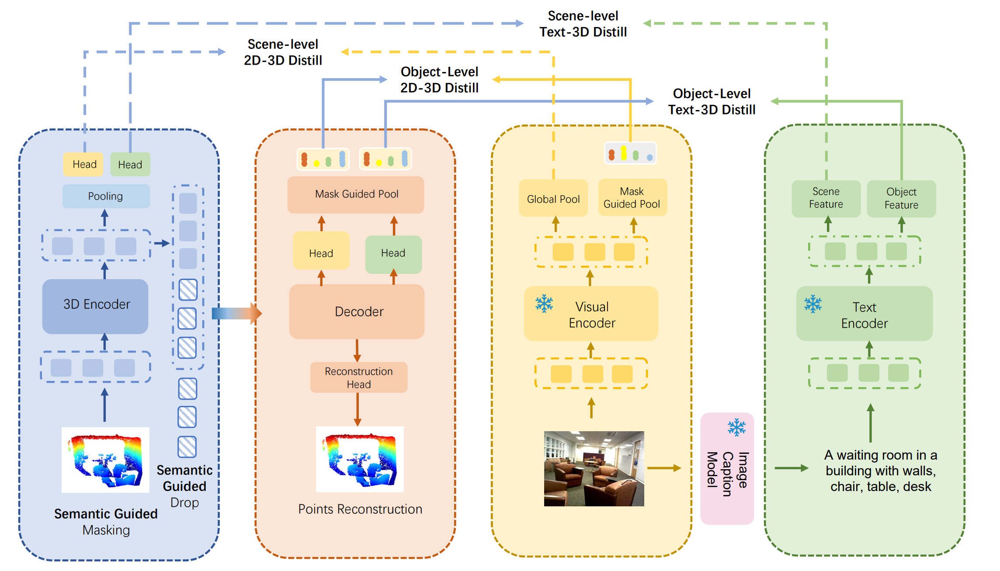

# Bridge3D

> [**Bridging the Domain Gap: Self-Supervised 3D Scene Understanding with Foundation Models**](https://arxiv.org/abs/2305.08776) <br>

This is the official repository for the NeurIPS 2023 paper: Bridging the Domain Gap: Self-Supervised 3D Scene Understanding with Foundation Models. 

<div  align="center">    
 
</div>


## 1. Requirements
PyTorch >= 1.8.0;
python >= 3.8;

```
pip install -r requirements.txt
```
```
# Chamfer Distance & emd
cd ./Pretrain/extensions/chamfer_dist
python setup.py install --user
cd ./Pretrain/extensions/emd
python setup.py install --user
# PointNet++
pip install "git+https://github.com/erikwijmans/Pointnet2_PyTorch.git#egg=pointnet2_ops&subdirectory=pointnet2_ops_lib"
# GPU kNN
pip install --upgrade https://github.com/unlimblue/KNN_CUDA/releases/download/0.2/KNN_CUDA-0.2-py3-none-any.whl
```
## 2. Datasets

See the Preprocess parts.

## 3. Bridge3D Weights

Pre-training [here](https://drive.google.com/file/d/1HP72jPbWumXt0Z5TXXCYHfi-GRIWjfL2/view?usp=sharing)

3detr on Scannet [here](https://drive.google.com/file/d/1UYZumcNdCEBGKG6JAyLNPPsGuPEizcgI/view?usp=sharing)

## 4. Bridge3D Pre-training
```
CUDA_VISIBLE_DEVICES=0,1 python main.py --config cfgs/pretrain/base.yaml --exp_name ./output
```

## 5. Fine-tuning
See Downstream parts 

## Cite

If you find our work helpful for your research. Please consider citing our paper.
```
@article{chen2023bridging,
  title={Bridging the Domain Gap: Self-Supervised 3D Scene Understanding with Foundation Models},
  author={Chen, Zhimin and Li, Bing},
  journal={arXiv preprint arXiv:2305.08776},
  year={2023}
}
```
